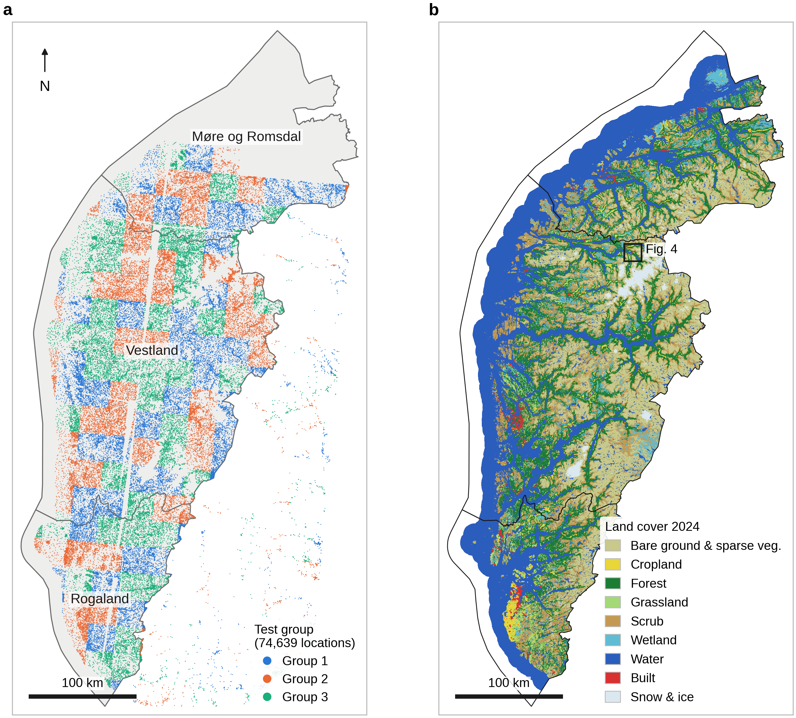
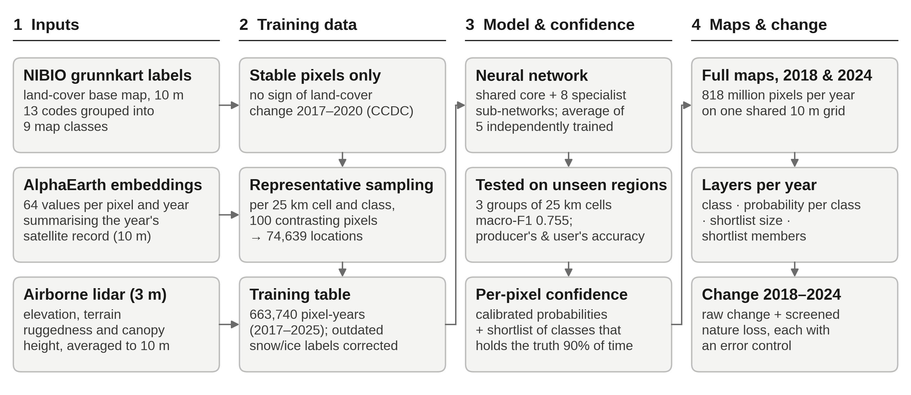
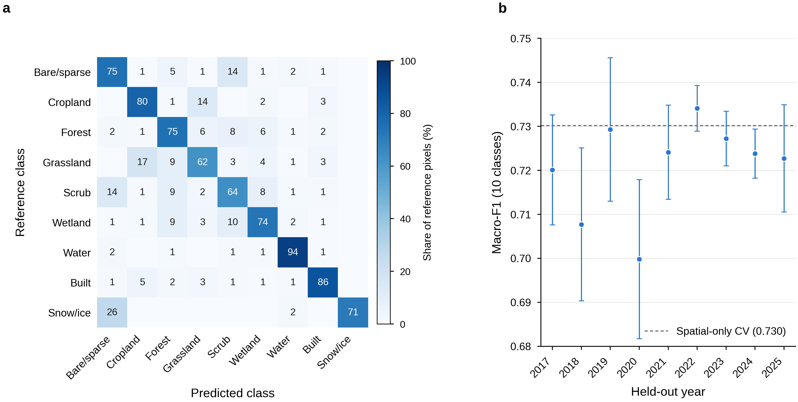
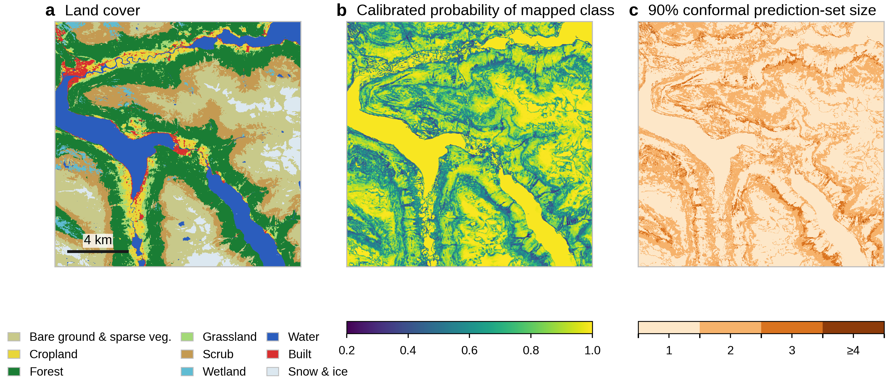
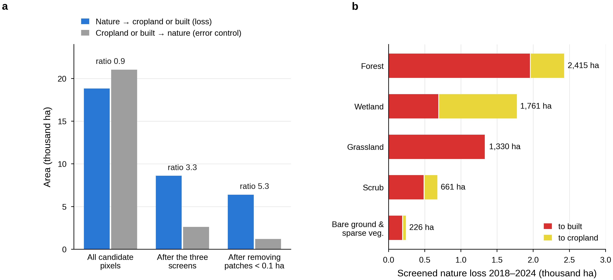

# Methods

## Study area

The study area covers the three western Norwegian counties of Rogaland, Vestland and Møre og Romsdal, about 92,000 km² including coastal and fjord waters (Fig. 1). Within short distances it runs from lowland farmland on the south-western coastal plain, through fjord valleys with forest and scrub, to mountain plateaux carrying glaciers and permanent snowfields. All maps share one 10 m grid (ETRS89 / UTM zone 33N, EPSG:32633), clipped to the county boundaries. Satellite input was available for about 82,000 km² (89% of the area; 817.9 million pixels). The remaining 11% is marked as unclassified corresponding to marine water.

**Fig. 1 | Study area and training locations.** **a**, The three counties, with the 74,639 training locations coloured by the test group they belong to. Groups are made of whole 25 km cells, so that each group can be tested on as an unseen region. Locations east of the county boundary lie inside the rectangular sampling frame but outside the mapped area. **b**, The 2024 land-cover map, shown at 250 m for display, with the area enlarged in Fig. 4.

**Fig. 2 | Workflow.** Satellite, lidar and base-map inputs (1) are combined into a training table (2) and used to fit and test the classification model, which also yields per-pixel confidence (3). The model then maps both years in full, and the two maps are compared to detect change (4).

## Input data

Each 10 m pixel was described by 67 numbers: 64 from a satellite "embedding" product and 3 terrain and vegetation-structure measures from airborne lidar.

**Satellite embeddings.** Rather than raw imagery, we used Google DeepMind's AlphaEarth Foundations annual embeddings (Earth Engine collection `GOOGLE/SATELLITE_EMBEDDING/V1/ANNUAL`). For each pixel and year, a pretrained model condenses a full year of optical (Sentinel-2, Landsat), radar (Sentinel-1), L-band radar (ALOS PALSAR-2), lidar canopy height (GEDI), elevation (Copernicus GLO-30 DEM), climate reanalysis (ERA5-Land) and gravity (GRACE) observations into 64 numbers. These numbers capture the pixel's spectral character and its seasonal pattern, such as green-up, snow cover and harvest. Cloud gaps and differences between sensors are dealt with during this compression. The individual numbers have no direct physical meaning, but pixels with similar land cover have similar values. For mapping, the 46 embedding tiles covering the area for 2018 and 2024 were downloaded from the public source.coop mirror, reprojected to the common grid without altering values, and mosaicked.

**Airborne lidar.** From the national 3 m lidar terrain model and canopy height model (809 tiles) we derived three variables: ground elevation, terrain ruggedness (the Terrain Ruggedness Index, the mean absolute height difference between a cell and its eight neighbours) and canopy height. Ruggedness was calculated at 3 m, and all three were then averaged to 10 m. Lidar covered 56% of the classified area. Elsewhere, including open water, each variable was set to its median value in the training data, so these pixels are classified from the satellite embeddings alone. We also tested a 30 m Copernicus elevation model with slope and aspect, and the Global Pasture Watch 2022 grassland layers. Neither improved accuracy, so both were left out.

## Reference labels and sampling

Training and test labels came from NIBIO's Grunnkart Arealregnskap, a national land- and ecosystem-type inventory for Norway, rasterised to 10 m for the three counties. Eight of its ecosystem types map directly onto our classes — cropland, forest, grassland, heathland and scrub, inland wetlands, rivers and lakes, coastal and marine water, and sparsely vegetated ground — and two more classes are picked out from separate land-cover and ground-condition attributes in the same dataset: bare rock and sand, and permanent snow and ice.

Built land (class 10) is not part of this ecosystem classification. It is added afterwards by overlaying building, road and other paved-surface footprints from Norway's national large-scale topographic database (Felles KartBase, FKB) on top of the ecosystem map, overwriting whatever class was mapped underneath. The labels used to train the model take buildings, roads and paved surfaces from a single FKB product (Grønnstruktur). We separately built a refined overlay that instead sources buildings from FKB Bygning 2018, a dedicated national building database (current to December 2018) that resolves more of the small, isolated rural buildings the older product misses, while keeping roads and paved surfaces from Grønnstruktur as before. Applying the refined overlay changed only 3 of the 74,639 training locations and did not change accuracy (Δ macro-F1 = −0.0002 on retraining); adding the newly found buildings as extra training rows instead made the model worse at recognising built land (F1 −0.0095), because most of them are single, isolated 10 m pixels whose spectral signal is dominated by the surrounding vegetation rather than the building. We therefore trained the model on the first overlay, and treat the refined one as the more accurate reference for where buildings actually are rather than as extra training data.

Of the resulting 13 codes, "other" (13) was excluded, sand (1) was merged into rock and sand (2), and sea (9) into inland water (8). In the delivered product, sparse vegetation (11) was also merged into bare ground (2). This gives nine classes (Table 1). Bare ground and sparse vegetation were merged because users of the map did not need them separated, not to raise accuracy. Mapping them separately and combining them afterwards gave practically the same result.

Training locations were chosen so that they cover the full range of conditions within each class, rather than at random. The area was divided into 25 × 25 km cells. Within each cell and class we considered only pixels that showed no sign of land-cover change between 2017 and 2020, using the CCDC change-detection product (no break with probability ≥ 0.99). These pixels were grouped into 100 clusters of similar satellite signature, and one pixel was drawn per cluster. This gave 74,639 locations. Satellite and lidar values were extracted at every location for each year from 2017 to 2025, yielding 663,740 labelled pixel-years.

Base-map labels contain errors, so we tested each class for whether its errors could be corrected. Only snow and ice qualified. At 29 of its 146 locations the base map records glacier or snowfield where the satellite record consistently shows rock or debris, most likely because the polygons pre-date glacier retreat. For this class alone we corrected labels flagged by an automated label-checking method (confident learning, implemented in the cleanlab package), which changed 295 of the 663,740 records. Applying the same correction to the other classes made accuracy worse. For them, apparent label errors are mostly real ambiguity at class boundaries, for example pasture versus hay meadow. Corrections were only ever made to training data, never to the data used for testing.

| Code | Map class | Base-map codes included |
| --- | --- | --- |
| 2 | Bare ground and sparse vegetation | 1 sand, 2 rock and sand, 11 sparse vegetation |
| 3 | Cropland | 3 |
| 4 | Forest | 4 |
| 5 | Grassland | 5 |
| 6 | Scrub | 6 |
| 7 | Wetland | 7 |
| 8 | Water | 8 inland water, 9 sea |
| 10 | Built | 10 |
| 12 | Snow and ice | 12 |

Table 1 | The nine map classes and the base-map codes they contain. Code 13, "other", was not mapped. The merged bare-ground class joins two contrasting settings: rock and sand concentrated at the coast (median elevation 13 m in the training data) and sparsely vegetated alpine ground (median 797 m). Code 10 (built) comes from the separate FKB overlay described above, not from the ecosystem classification itself.

## Classification model

Pixels were classified by a small neural network, a flexible statistical model that learns the relationship between the 67 input values and the nine classes from the training data. Each pixel passes through a shared core network (two layers of 256 and 128 units) that is common to all pixels. It is also passed to two of eight smaller specialist sub-networks, chosen automatically from the pixel's own values; this design is known as a shared-expert mixture of experts. The specialists start switched off and can only add corrections to the core, so they cannot make the model worse than the core alone. Each network has about 79,000 adjustable parameters, which is small by current standards.

We trained five copies of this network from different random starting points and averaged their predicted class probabilities; averaging several models is a simple and robust way to reduce chance errors. Rare classes were given extra weight during training, so the model was not dominated by water and forest. Training stopped automatically once accuracy on a held-back 10% of the data stopped improving (full settings: Adam optimiser, learning rate 10⁻³, weight decay 10⁻⁴, batches of 4,096, dropout 0.3, label smoothing 0.05, class weights proportional to 1/√(class frequency), early stopping after 15 epochs without improvement). The final model was trained on all 663,740 pixel-years in about 13 minutes on one graphics processor.

This design was chosen after comparing more than 100 alternatives on the same test, including larger and deeper networks, region-specific models, random forests and gradient-boosted trees. Larger or more complex models fitted the training regions better but predicted new regions worse. Averaging five networks was the only change that reliably helped. The specialist sub-networks were kept for one reason: they raised the F1 score for snow and ice, the rarest class, from 0.80 to 0.84. Their effect on the other classes was negligible.

**Confidence and uncertainty per pixel.** Raw probabilities from neural networks tend to be overconfident. We therefore recalibrated them with Venn–Abers calibration, fitted on predictions for locations the model had not been trained on. After calibration, a pixel given 80% probability of forest is, on average, forest 80% of the time. We then used conformal prediction to give every pixel a *prediction set*: the shortlist of classes that cannot be ruled out. The sets are built so that the true class is included 90% of the time, and this holds separately for each class, not just on average (class-conditional or "Mondrian" conformal prediction with the least-ambiguous set-valued classifier score). A set of one class means the pixel is confidently mapped. A set of three or four classes means the pixel is ambiguous and should not be used on its own.

## Map production

The 2018 and 2024 maps were made with the same model, on the same grid, and cover exactly the same 817,880,567 pixels, so they can be compared pixel by pixel. Before mapping, we checked that the satellite mosaic for each year covered the whole study area. Pixels without satellite data were left unclassified. Mapping one year took about 17 minutes on a single workstation. For each year the delivered product has four layers: (i) the land-cover class; (ii) the calibrated probability of each of the nine classes; (iii) the size of the 90% prediction set; and (iv) which classes that set contains. No smoothing or minimum mapping unit was applied to the land-cover maps themselves.

## Detecting change between 2018 and 2024

Comparing two independently made maps exaggerates change, because every classification error in either year looks like a change. We therefore built two change products and measured their error directly.

**All class changes.** A simple change / no-change layer flags every pixel whose class differs between the years. To judge how much of this is real, we used two checks. First, we recalculated the change rate using only pixels that were confidently mapped (a one-class prediction set) in both years. Second, we used built land as a control: buildings and roads rarely revert to vegetation within six years, so built pixels that appear to "leave" the class estimate the error rate.

**Nature loss.** The second layer targets the change of most ecological interest: natural land in 2018 (bare ground, forest, grassland, scrub, wetland, water, snow and ice) that became cropland or built land by 2024. Change in the opposite direction, from cropland or built land back to nature, served as the error control. It is rare in reality, so its apparent area estimates how many false losses remain. Candidate loss pixels had to pass three screens. First, the 2024 class must have been ruled out in 2018, so it was absent from the 2018 prediction set. Second, at least three of the eight neighbouring pixels had to show the same change, because isolated single pixels are typical of noise. Third, transitions that are artefacts by construction were excluded: water or snow becoming cropland or built land reflects shorelines and snow timing, not development. Grassland becoming cropland was also excluded, because the two are hard to separate (see Results). Finally, patches smaller than 10 pixels (0.1 ha) were removed. The same steps were applied to the control, so that the ratio of loss to reverse change measures the quality of the layer. A ratio of 1 means the layer is indistinguishable from noise.

## Accuracy assessment

Accuracy was tested on places the model had never seen. The 25 km sampling cells were split into three groups. The model was trained on two groups and tested on the third, and this was repeated so that every location was tested once (spatially blocked three-fold cross-validation). All nine years of a location always fell in the same group. This is stricter than a random split, where nearby, near-identical pixels end up in both training and test data and inflate accuracy. Test labels were used exactly as mapped in the base map, without correction.

We report producer's accuracy (the share of reference pixels of a class that the map gets right; the complement of omission error) and user's accuracy (the share of pixels mapped as a class that truly belong to it; the complement of commission error). We also report their harmonic mean, the F1 score. The headline measure is macro-F1, the unweighted mean of the nine class F1 scores, which gives rare classes such as snow and ice the same weight as water. Because training locations were stratified by class rather than drawn in proportion to area, these figures describe how well each class is recognised. They are not area-weighted estimates of map accuracy.

To test whether the model is equally reliable in different years, we also held out one year and one spatial group at the same time, so the model was tested on a place and a year it had not seen.

# Results

## How accurate the maps are

On locations the model had never seen, the nine classes were recognised with a macro-F1 of 0.755 (range across the three test groups 0.738–0.761). Overall, 78.7% of test pixels were assigned the correct class, and for 92% of them the true class was one of the two most likely classes. Water, built land and cropland were mapped most reliably, and grassland and scrub least reliably (Table 2). For comparison, on the earlier ten-class legend this model scored 0.734, against 0.714 for the project's previous CatBoost + TabICL model and 0.695 for a tuned random forest trained on the same data.

| Class | Test pixels | Producer's accuracy | User's accuracy | F1 |
| --- | --: | --: | --: | --: |
| Water | 178,299 | 0.94 | 0.97 | 0.95 |
| Built | 46,199 | 0.86 | 0.83 | 0.85 |
| Cropland | 57,495 | 0.80 | 0.77 | 0.79 |
| Bare ground and sparse vegetation | 88,747 | 0.75 | 0.77 | 0.76 |
| Snow and ice | 1,314 | 0.71 | 0.79 | 0.75 |
| Forest | 91,977 | 0.75 | 0.73 | 0.74 |
| Wetland | 50,901 | 0.74 | 0.65 | 0.69 |
| Scrub | 105,930 | 0.64 | 0.70 | 0.67 |
| Grassland | 42,878 | 0.62 | 0.58 | 0.60 |

Table 2 | Accuracy per class on spatially held-out locations (663,740 pixel-years pooled over three test groups). Producer's accuracy = 1 − omission error; user's accuracy = 1 − commission error; F1 is their harmonic mean. Figures are per sampled pixel, not weighted by class area.

**Fig. 3 | Accuracy on unseen locations and years.** **a**, Where each class ends up. Each row shows how the test pixels of one reference class were mapped, so the diagonal is producer's accuracy. Values below 0.5% are left blank. **b**, Macro-F1 when a whole year was withheld together with the test locations, for the earlier ten-class version of the model. Points are means over the three test groups; whiskers show ±1 standard deviation. The dashed line is the score when only locations were withheld.

Most errors fall between classes that also grade into each other on the ground (Fig. 3a). Grassland was mapped as cropland in 17% of cases, and scrub and bare ground and sparse vegetation were confused in about 14% of cases in each direction. Snow and ice was mapped as bare ground in 26% of cases. This matches the outdated glacier outlines found in the base map, so part of this "error" probably lies in the reference data rather than the map.

The model was nearly as accurate for years it had not seen: withholding a year cost 0.009 in macro-F1, and scores for individual years ranged from 0.700 to 0.734 (Fig. 3b). Snow and ice was the exception, varying from 0.48 to 0.73 between years, so year-to-year differences in this class should be treated with caution.

## Land cover in 2018 and 2024

The maps describe a coastal, mountainous landscape. In 2024 about a third of the classified area was water (including fjords and coastal sea), a fifth bare ground and sparse vegetation, and a sixth each forest and scrub. Built land made up 1.4% (Table 3; Fig. 1b). Every class changed by less than one percentage point between the two years. The largest apparent shifts were a gain of 579 km² of wetland and a loss of 321 km² of bare ground and sparse vegetation. Both are within the range of classification error for these classes, so they should not be read as real trends. Built land apparently *shrank* by 83 km², which cannot be real; this shows the size of the error in these net figures.

| Class | 2018 (km²) | 2024 (km²) | 2018 (%) | 2024 (%) | Difference (percentage points) |
| --- | --: | --: | --: | --: | --: |
| Water | 27,242 | 27,173 | 33.31 | 33.22 | −0.08 |
| Bare ground and sparse vegetation | 16,063 | 15,743 | 19.64 | 19.25 | −0.39 |
| Forest | 14,224 | 14,099 | 17.39 | 17.24 | −0.15 |
| Scrub | 13,083 | 12,852 | 16.00 | 15.71 | −0.28 |
| Wetland | 4,520 | 5,099 | 5.53 | 6.23 | +0.71 |
| Grassland | 2,225 | 2,485 | 2.72 | 3.04 | +0.32 |
| Cropland | 1,817 | 1,951 | 2.22 | 2.39 | +0.16 |
| Snow and ice | 1,396 | 1,252 | 1.71 | 1.53 | −0.18 |
| Built | 1,217 | 1,134 | 1.49 | 1.39 | −0.10 |

Table 3 | Mapped area of each class (817.9 million pixels, ≈81,790 km², in both years). Areas are pixel counts and have not been adjusted for classification error.

## Where the maps are uncertain

About 60% of pixels were mapped with confidence, meaning the model could rule out every class but one. On average a pixel's prediction set held 1.47 classes. On held-out test data the sets contained the true class 90.0–90.2% of the time for every class, as intended. Calibration brought stated probabilities into line with observed frequencies: the average gap between them (expected calibration error) fell from 5.1 to 0.6 percentage points.

Uncertainty is not spread evenly (Fig. 4). Open water, glacier interiors and continuous forest are mapped with near certainty. Uncertainty concentrates along transitions between forest, scrub and open mountain, and in the fine-grained mosaic of fields, pasture and buildings on valley floors. These are the ecotones where the classes themselves grade into one another.

**Fig. 4 | The three map layers for a 16 × 16 km area around Loen and Stryn (Vestland), 2024, at full 10 m resolution.** **a**, Land-cover class. **b**, Calibrated probability of the mapped class. **c**, Number of classes in the 90% prediction set: 1 = confidently mapped; 3 or more = ambiguous.

## Change between 2018 and 2024

**Simple map comparison overstates change.** Of the classified area, 7.1% (≈5,800 km²) had a different class in 2024 than in 2018. Most of this is classification error, not change on the ground. 21% of the pixels mapped as built land in 2018 were mapped as something else in 2024, although buildings and roads rarely disappear within six years. The largest transitions also ran in both directions between the same pairs of classes: 1.07% of the area went from bare ground to scrub, while 0.55% went from scrub to bare ground. This back-and-forth between classes that are known to be confused is typical of error. Among pixels mapped confidently in both years (60% of the area), only 0.40% changed class, about one eighteenth of the raw rate. The raw change layer should therefore not be used to estimate land-cover change. Its main value is to show where confident change occurs.

**Screened nature loss.** Before screening, apparent conversion of nature to cropland or built land (18,825 ha) was smaller than the apparent reverse conversion (21,041 ha), which is impossible at that scale; the raw signal was pure noise (Fig. 5a). After the three screens and removal of patches smaller than 0.1 ha, 6,394 ha of nature loss remained, in 15,699 patches, against 1,202 ha in the reverse control. Nature loss therefore now exceeds the error control 5.3 times. Taking the control as an estimate of remaining false positives, net nature loss is about 5,200 ha, or 0.06% of the classified area over six years. This estimate may still be somewhat optimistic, because cropland and built land are easier to recognise than the natural classes they replace.

Forest accounted for the largest share of the loss (2,415 ha, 81% of it to built land), followed by wetland (1,761 ha) and grassland (1,330 ha; Fig. 5b). Wetland was the only natural class lost mainly to cropland (1,074 ha to cropland against 688 ha to built land). Grassland loss is to built land only, because grassland-to-cropland conversion was excluded by design. Overall, 4,645 ha were lost to built land and 1,749 ha to cropland.

**Fig. 5 | Loss of natural land to cropland and built land, 2018–2024.** **a**, Area of apparent loss (blue) and of the opposite, largely impossible, change from cropland or built land back to nature (grey), which serves as an error control. Values are shown before screening, after the three screens and after removing patches smaller than 0.1 ha; the ratio of loss to control is printed above each pair. **b**, Screened nature loss by 2018 class, split by what replaced it. Grassland-to-cropland conversion was excluded from the analysis.

The maps also show 201 km² of snow and ice in 2018 that was bare ground in 2024, consistent in direction with glacier retreat. Snow and ice is, however, the least reliable class from year to year (see above), and this figure has not been screened.

# References

1. Brown, C. F. et al. AlphaEarth Foundations: an embedding field model for accurate and efficient global mapping from sparse label data. arXiv:2507.22291 (2025).
2. Riley, S. J., DeGloria, S. D. & Elliot, R. A terrain ruggedness index that quantifies topographic heterogeneity. *Intermountain J. Sci.* **5**, 23–27 (1999).
3. Zhu, Z. & Woodcock, C. E. Continuous change detection and classification of land cover using all available Landsat data. *Remote Sens. Environ.* **144**, 152–171 (2014).
4. Northcutt, C., Jiang, L. & Chuang, I. Confident learning: estimating uncertainty in dataset labels. *J. Artif. Intell. Res.* **70**, 1373–1411 (2021).
5. Dai, D. et al. DeepSeekMoE: towards ultimate expert specialization in mixture-of-experts language models. arXiv:2401.06066 (2024).
6. Vovk, V. & Petej, I. Venn–Abers predictors. *Proc. 30th Conf. Uncertainty in Artificial Intelligence*, 829–838 (2014).
7. Sadinle, M., Lei, J. & Wasserman, L. Least ambiguous set-valued classifiers with bounded error levels. *J. Am. Stat. Assoc.* *114**, 223–234 (2019).
8. Vovk, V. Conditional validity of inductive conformal predictors. *Proc. Asian Conf. Machine Learning* **25**, 475–490 (2012).

